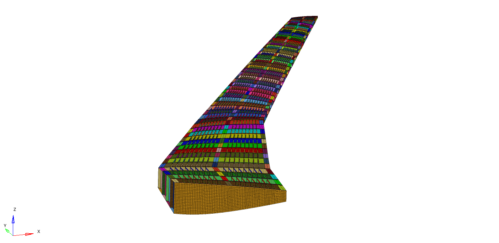

# Parametric Design and Meshing of Wings (pyPDMW)
Parametric wing structure design tool in Python-HyperMesh.

Pieces of software Needed:
- HyperMesh

Libraries:
- math
- numpy
- time
- urllib.request
- subprocess
- os
- matplotlib (if diagrams are needed)

You must change all the relative paths if install to other PC

An example of the program's capabilities:

